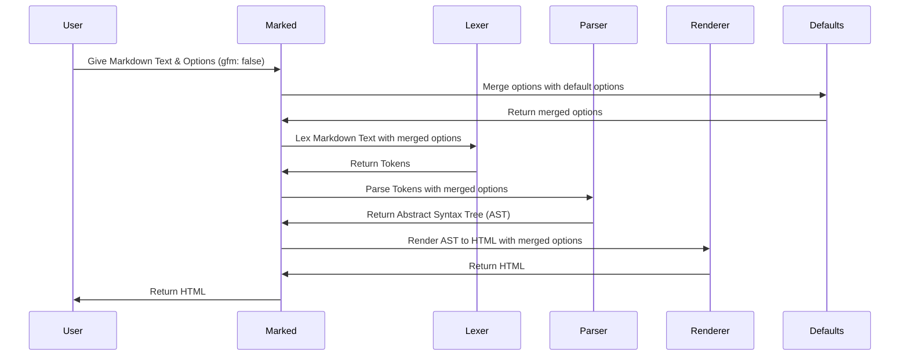

# Chapter 2: Marked Options

In the previous chapter, [Marked (Instance)](01_marked__instance__.md), you learned how to create a `Marked` instance and use its `parse` method to convert Markdown to HTML. Now, let's talk about how to customize that conversion process! Imagine you want to tweak how `marked` handles certain Markdown features. That's where `Marked Options` come in.

Think of `Marked Options` as the settings on a camera. Just like you can adjust the aperture, shutter speed, and ISO on a camera to get the perfect shot, you can adjust the options of `marked` to control how your Markdown is parsed and rendered into HTML.

## The Need for Options: A Concrete Example

Let's say you're writing a blog post with Markdown, and you want to use GitHub Flavored Markdown (GFM), which automatically creates links from URLs. By default, `marked` has GFM enabled, but what if you *didn't* want that behavior for a specific document? Or, conversely, what if GFM wasn't enabled and you wanted to turn it on? This is where options come in handy!

## What are `MarkedOptions`?

`MarkedOptions` is a configuration object. It's a JavaScript object that contains various settings that `marked` uses when parsing and rendering your Markdown. It's defined in `src/MarkedOptions.ts`.

Here are some key options you'll likely use:

*   **`gfm`:**  Enables or disables GitHub Flavored Markdown (GFM).  GFM adds extra features to standard Markdown, like autolinking URLs and task lists. The default is `true`.
*   **`breaks`:** Enables GFM line breaks. When enabled, single line breaks in your Markdown will be rendered as `<br>` tags in HTML. The default is `false`.
*   **`pedantic`:**  Conforms to obscure parts of markdown.pl as much as possible. Don't fix any of the original markdown bugs or poor behavior. The default is `false`.
*   **`async`:**  When true, parse will return a promise (useful when extensions perform asynchronous operations).  The default is `false`.
*   **`extensions`**: An advanced way to add or modify `marked`'s behaviour. We won't cover extensions in depth in this chapter, but they allow you to add custom tokenizers, renderers, and hooks.

## How to Use `MarkedOptions`

You can pass `MarkedOptions` to the `Marked` constructor or directly to the `parse` method. Let's see how this works with the `gfm` option.

**Example 1: Disabling GFM using the constructor**

```javascript
import { Marked } from 'marked';

const marked = new Marked({ gfm: false }); // Disable GFM globally for this instance
const markdownText = 'Visit https://example.com'; // Normally GFM would autolink this
const html = marked.parse(markdownText);

console.log(html);
```

In this example, we create a new `Marked` instance and pass in an options object `{ gfm: false }`. This disables GFM for *all* Markdown parsed by this instance.  The `console.log(html)` would then print out the HTML with the URL as plain text, not a link.

**Example 2: Enabling breaks using the `parse` method**

```javascript
import { Marked } from 'marked';

const marked = new Marked(); // Use default options (GFM is true)
const markdownText = `This is a line.
This is another line.`; // Normally this would be a single paragraph

const html = marked.parse(markdownText, { breaks: true }); // Enable breaks just for this parse

console.log(html);
```

Here, we create a `Marked` instance with the default options. Then, we pass an options object `{ breaks: true }` directly to the `parse` method. This enables GFM line breaks only for this specific parsing operation.  The `console.log(html)` would now output the HTML with `<br>` tags after the first line, creating two separate lines in the output.

**Setting options using the `setOptions` method**
```javascript
import { Marked } from 'marked';

const marked = new Marked();

marked.setOptions({ gfm: false }); // Set the option

const markdownText = 'Visit https://example.com'; // Normally GFM would autolink this
const html = marked.parse(markdownText);

console.log(html);
```
Here, we use the `setOptions` method to set the options. This will set the options for all future calls to the `parse` method.

## Under the Hood: How Options Affect Parsing

When you pass `MarkedOptions`, they influence how the `marked` pipeline (lexer, parser, renderer) processes your Markdown. Let's walk through a simplified view of how this happens, focusing on the `gfm` option:



1.  **Option Merging:** The `Marked` instance merges the options you provide with its default options. This ensures that all necessary settings are available. This happens in the `setOptions` function and in the `parseMarkdown` function in `src/Instance.ts`.

2.  **Lexer, Parser, and Renderer:** The merged options are then passed to the [Lexer](03_lexer_.md), [Parser](06_parser_.md), and [Renderer](07_renderer_.md). These components use the options to determine how to handle specific Markdown elements. For example, the `Lexer` checks the `gfm` option to decide whether to recognize autolinks.

Let's look at a snippet from `src/defaults.ts` to see how default options are managed:

```typescript
// src/defaults.ts
import type { MarkedOptions } from './MarkedOptions.ts';

/**
 * Gets the original marked default options.
 */
export function _getDefaults(): MarkedOptions {
  return {
    async: false,
    breaks: false,
    extensions: null,
    gfm: true,
    hooks: null,
    pedantic: false,
    renderer: null,
    silent: false,
    tokenizer: null,
    walkTokens: null,
  };
}

export let _defaults = _getDefaults();
```

This code shows the default values for the `MarkedOptions`.  Notice that `gfm` is set to `true` by default. When you provide your own options, they override these default values.

## Conclusion

In this chapter, you've learned about `MarkedOptions` and how they allow you to customize the Markdown to HTML conversion process. You've seen how to use options to enable or disable features like GFM and line breaks.  You've also gained a basic understanding of how these options influence the lexing, parsing, and rendering pipeline.

In the next chapter, we'll dive into the [Lexer](03_lexer_.md), the first step in the Markdown parsing process. You'll learn how the `Lexer` breaks down Markdown text into tokens, setting the stage for further processing.


---

Generated by [AI Codebase Knowledge Builder](https://github.com/The-Pocket/Tutorial-Codebase-Knowledge)