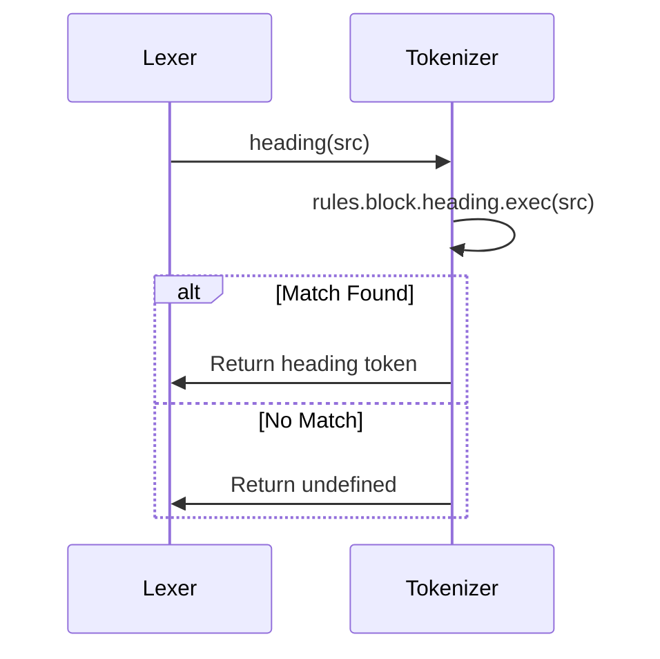

# Chapter 4: Tokenizer

In the previous chapter, [Lexer](03_lexer_.md), you learned how the `Lexer` breaks down Markdown text into a stream of tokens. Now, let's zoom in on *how* the `Lexer` knows what constitutes a token! That's where the `Tokenizer` comes in.

Imagine the `Lexer` is a detective trying to understand a crime scene. The `Tokenizer` provides the detective with the tools and knowledge to identify clues (tokens). It's like a guide that tells the detective, "If you see a line starting with '#', that's a heading!"

## What is the `Tokenizer`?

The `Tokenizer` (primarily in `src/Tokenizer.ts`) is responsible for defining the *rules* used to identify tokens. It's like a rulebook that the `Lexer` consults. It uses regular expressions (fancy text patterns) to match different parts of the Markdown source and extract their text and properties. These properties can be the `depth` of a heading, or the `href` and `title` of a link.

The `Lexer` delegates calls to the `Tokenizer` to recognize things like headings, lists, code blocks, and links. The `Tokenizer` doesn't do the whole job; it just focuses on recognizing individual parts.

## Key Concepts

*   **Rules:** The `Tokenizer` holds the regular expressions (patterns) used to identify different Markdown elements.
*   **Regular Expressions:** These are text patterns that match specific sequences of characters.  For example, the regular expression `^#+\s+(.*)$` matches a line starting with one or more '#' characters (a heading).
*   **Token Matching:** The process of using regular expressions to find and extract tokens from the Markdown source.

## Using the `Tokenizer` (Indirectly)

You don't directly call methods on the `Tokenizer` yourself. Instead, the `Lexer` uses the `Tokenizer` internally. However, understanding how the `Tokenizer` works helps you grasp the entire `marked` parsing process.

Let's revisit our earlier example from the [Lexer](03_lexer_.md) chapter:

**Input (Markdown):**

```markdown
# My Heading

This is a paragraph.
```

The `Lexer` uses the `Tokenizer` to identify the heading and the paragraph. The `Tokenizer` provides the regular expressions that match those elements.

Behind the scenes, the `Lexer` would essentially ask the `Tokenizer`:

1.  "Does this line match the heading rule?" (The `Tokenizer` says "Yes!")
2.  "Does this line match the paragraph rule?" (The `Tokenizer` says "Yes!")

Based on the `Tokenizer`'s answers, the `Lexer` creates the appropriate tokens.

## Under the Hood: How the `Tokenizer` Works

The `Tokenizer` works by holding a collection of regular expressions, each designed to match a specific type of Markdown element. When the `Lexer` needs to identify a token, it calls the appropriate method on the `Tokenizer`, passing in the current portion of the Markdown text.

Here's a simplified view of the interaction between the `Lexer` and the `Tokenizer`:



1.  The `Lexer` calls a specific method on the `Tokenizer`, such as `heading(src)` or `paragraph(src)`, passing the current section of the Markdown source (`src`).
2.  The `Tokenizer` applies the corresponding regular expression (`rules.block.heading.exec(src)`) to the source text.
3.  If the regular expression matches, the `Tokenizer` extracts the relevant information (e.g., heading level, text) and returns a token object.
4.  If the regular expression does not match, the `Tokenizer` returns `undefined`.

Let's look at a simplified code snippet from `src/Tokenizer.ts` to see how the `heading` method works:

```typescript
// src/Tokenizer.ts

heading(src: string): Tokens.Heading | undefined {
  const cap = this.rules.block.heading.exec(src);
  if (cap) {
    return {
      type: 'heading',
      raw: cap[0],
      depth: cap[1].length,
      text: cap[2].trim(), // Extract heading text
      tokens: this.lexer.inline(cap[2].trim()), // Tokenize inline content
    };
  }
}
```

This code shows that the `heading` method attempts to match the `rules.block.heading` regular expression against the input `src`. If a match is found (the `if (cap)` condition), it extracts the heading level (`cap[1].length`) and the heading text (`cap[2].trim()`) and creates a `heading` token. If no match is found, the method returns `undefined`.

## Regular Expressions: The Heart of the Tokenizer

The regular expressions are defined in `src/rules.ts` and are used by the `Tokenizer` to identify different Markdown elements. Let's look at a simplified example of the heading regular expression:

```typescript
// src/rules.ts

export const block = {
  normal: {
    heading: /^ *(#{1,6}) +([^\n]+?) *#* *(?:\n+|$)/,
  },
};
```

This regular expression matches a line starting with one to six '#' characters (representing the heading level), followed by a space, followed by the heading text, and optionally followed by trailing '#' characters and a newline.

**Explanation:**

*   `^`: Matches the beginning of the line.
*   ` *`: Matches zero or more spaces.
*   `#{1,6}`: Matches one to six '#' characters.
*   ` +`: Matches one or more spaces.
*   `([^\n]+?)`: Matches any characters that are not a newline (the heading text).
*   ` *`: Matches zero or more spaces.
*   `#*`: Matches zero or more '#' characters.
*   ` *(?:\n+|$)`: Matches zero or more spaces, followed by either a newline or the end of the string.

Understanding regular expressions is key to understanding how the `Tokenizer` works.

## How Options Influence the Tokenizer

The [Marked Options](02_marked_options_.md) also influence the `Tokenizer`. For example, the `pedantic` option affects how headings are parsed. When `pedantic` is `true`, the `Tokenizer` conforms more strictly to the original Markdown specification.

## Conclusion

In this chapter, you've learned about the `Tokenizer`, the component of `marked` responsible for defining the rules and patterns used to identify different Markdown elements. You've seen how the `Tokenizer` uses regular expressions to match tokens and how the [Lexer](03_lexer_.md) uses the `Tokenizer` to tokenize the Markdown source.

In the next chapter, we'll explore [Tokens](05_tokens_.md) themselves, the data structures that represent the different elements of the Markdown document after the lexing process.


---

Generated by [AI Codebase Knowledge Builder](https://github.com/The-Pocket/Tutorial-Codebase-Knowledge)