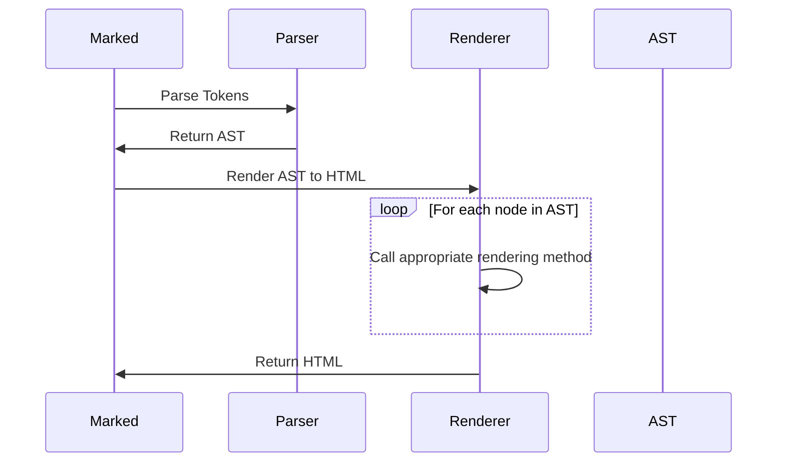

# Chapter 7: Renderer

In the previous chapter, [Parser](06_parser_.md), you learned how the `Parser` takes the tokens and creates a structured representation of your Markdown document. Now, let's talk about the part that turns this structure into the final HTML you see: the `Renderer`.

Imagine you have a detailed blueprint for a house, created by the architect (the `Parser`). The `Renderer` is like the construction crew that takes that blueprint and actually builds the house out of bricks and wood (HTML elements). It is responsible for transforming the structure of your Markdown document into the visual representation that users will see.

## The Need for a Renderer: A Concrete Example

Let's say you have a simple Markdown heading:

```markdown
# Hello, world!
```

The [Lexer](03_lexer_.md) and [Parser](06_parser_.md) work together to identify this as a heading and create a structured representation. But the browser doesn't understand Markdown. It needs HTML! The `Renderer` steps in and converts that structured representation into the following HTML:

```html
<h1>Hello, world!</h1>
```

The `Renderer` knows that a Markdown heading should be rendered as an `<h1>` tag in HTML.

## What is the `Renderer`?

The `Renderer` (primarily in `src/Renderer.ts`) is responsible for converting the structured Markdown tokens into HTML.  Imagine it as a painter who takes instructions (tokens) and uses them to create the final image (HTML). It provides methods for rendering different token types (e.g., `heading`, `paragraph`, `link`) into their corresponding HTML elements.

The `Renderer` takes the Abstract Syntax Tree (AST), created by the [Parser](06_parser_.md), and walks through it, generating HTML for each node in the tree.

## Key Concepts

*   **Rendering Methods:** The `Renderer` has separate methods for handling each type of Markdown element (e.g., `heading`, `paragraph`, `list`, `link`, `code`). Each method knows how to convert a specific token type into its corresponding HTML representation.
*   **HTML Generation:** The rendering methods generate HTML strings that represent the Markdown elements. These strings are then combined to create the final HTML output.

## Using the `Renderer` (Indirectly)

You don't usually interact with the `Renderer` directly. The `marked` instance handles calling the `Renderer` for you. However, understanding how the `Renderer` works helps you understand how `marked` generates HTML.

Let's revisit our example Markdown:

```markdown
# Hello, world!

This is a paragraph.
```

The `Renderer` would receive the structured representation of this Markdown (the AST) from the [Parser](06_parser_.md) and then:

1.  Call the `heading` method to render the heading.
2.  Call the `paragraph` method to render the paragraph.

The `heading` method would generate `<h1>Hello, world!</h1>`, and the `paragraph` method would generate `<p>This is a paragraph.</p>`. These HTML strings would then be combined to produce the final HTML output.

## A Simple Example

Even though you don't *directly* use the `Renderer`, let's imagine how you *could* if you were building a custom Markdown processor.

```javascript
import { Renderer } from 'marked';

const renderer = new Renderer();

// Let's pretend we have a "headingToken" that the Parser generated
const headingToken = {
  type: 'heading',
  depth: 1,
  tokens: [{ type: 'text', text: 'Hello, world!' }]
};

const html = renderer.heading(headingToken);

console.log(html); // Output: <h1>Hello, world!</h1>
```

This code is *simplified* for demonstration purposes. In reality, the `Renderer` receives the AST from the `Parser`.

Here, we create a new `Renderer` instance. We then create a sample `headingToken` (in reality, this would come from the [Parser](06_parser_.md)). Finally, we call the `renderer.heading()` method with the token. The result is the HTML string: `<h1>Hello, world!</h1>`, which is then printed to the console.

## Under the Hood: How the `Renderer` Works

The `Renderer` works by traversing the Abstract Syntax Tree (AST) created by the [Parser](06_parser_.md). For each node in the AST, it calls the appropriate rendering method to generate the corresponding HTML.

Here's a simplified view of the process:



1.  **Input:** The `Renderer` receives the AST from the [Parser](06_parser_.md).
2.  **Traversal:** The `Renderer` traverses the AST, visiting each node.
3.  **Method Dispatch:** For each node, the `Renderer` determines the node type and calls the corresponding rendering method (e.g., `heading`, `paragraph`, `link`).
4.  **HTML Generation:** The rendering method generates the HTML for the node.
5.  **Output:** The `Renderer` returns the complete HTML string, representing the entire Markdown document.

Let's look at a simplified code snippet from `src/Renderer.ts` to see how the rendering process is implemented:

```typescript
// src/Renderer.ts

export class _Renderer {
  // ...

  heading({ tokens, depth }: Tokens.Heading): string {
    return `<h${depth}>${this.parser.parseInline(tokens)}</h${depth}>\n`;
  }

  paragraph({ tokens }: Tokens.Paragraph): string {
    return `<p>${this.parser.parseInline(tokens)}</p>\n`;
  }

  link({ href, title, tokens }: Tokens.Link): string {
    const text = this.parser.parseInline(tokens);
    // ... logic to create the link ...
    return `<a href="${href}">${text}</a>`;
  }

  // ... other rendering methods
}
```

This code shows the `heading`, `paragraph`, and `link` methods. Each method takes a token as input and generates the corresponding HTML. Note that `this.parser.parseInline(tokens)` is used to render inline content within the tokens.

## Customizing the Renderer

One of the powerful features of `marked` is that you can customize the `Renderer`. This allows you to change the HTML that `marked` generates. For example, you could change the HTML for headings to include a custom CSS class. This can be done using extensions.

## Conclusion

In this chapter, you've learned about the `Renderer`, the component of `marked` responsible for converting the structured representation of a Markdown document (the AST) into the final HTML output. You've seen how the `Renderer` uses rendering methods to handle different token types and how it traverses the AST to generate the HTML.

In the next chapter, we'll explore [Hooks](08_hooks_.md), which provide advanced ways to customize the `marked` parsing process.


---

Generated by [AI Codebase Knowledge Builder](https://github.com/The-Pocket/Tutorial-Codebase-Knowledge)