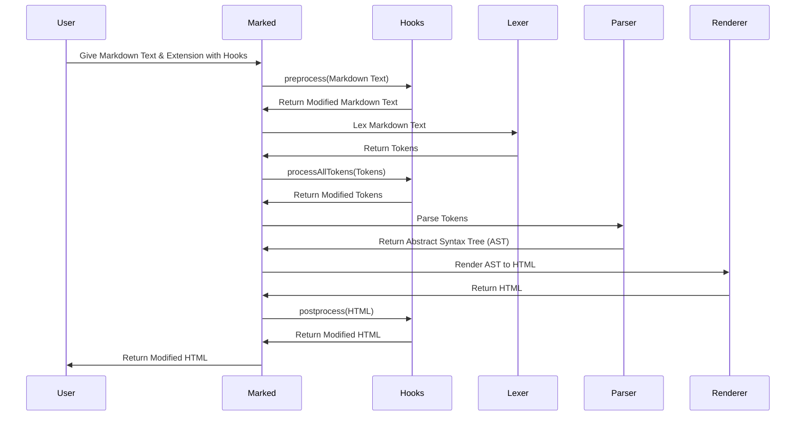

# Chapter 8: Hooks

In the previous chapter, [Renderer](07_renderer_.md), you learned how the `Renderer` converts the structured representation of your Markdown into HTML. Now, let's explore how to tap into the `marked` parsing process itself using `Hooks`.

Imagine you want to change the Markdown *before* it even gets parsed, or tweak the final HTML *after* `marked` is done. That's where `Hooks` come in! Think of them like middleware or event handlers; they allow you to intercept and modify the Markdown or HTML at different points in the processing pipeline.

## The Need for Hooks: A Concrete Example

Let's say you're building a blog and want to automatically add a "nofollow" attribute to all external links for SEO purposes. You could manually edit the HTML after `marked` generates it, but that's tedious. With `Hooks`, you can automatically modify the HTML *after* `marked` is finished, adding `rel="nofollow"` to all `<a>` tags.

## What are `Hooks`?

`Hooks` (defined in `src/Hooks.ts`) are functions that let you customize the `marked` parsing process. They are called at specific points:

*   **`preprocess`:** Called *before* lexing. You can modify the raw Markdown input here.
*   **`postprocess`:** Called *after* parsing. You can modify the final HTML output here.
*   **`processAllTokens`:** Called after lexing but before parsing. You can modify the array of tokens.
*    **`provideLexer` & `provideParser`**: Allows you to use a completely custom lexer and parser.

Consider them like checkpoints in a race, where you can make adjustments before the next stage.

## Key Concepts

*   **Interception:** `Hooks` allow you to intercept the Markdown or HTML at different stages of the parsing process.
*   **Modification:** You can modify the Markdown or HTML within the `Hook` functions.
*   **Customization:** `Hooks` provide a powerful way to customize `marked`'s behavior without changing its core code.
*   **Extensions:** `Hooks` are typically used within `marked` extensions to modify its behavior.

## Using Hooks: The `postprocess` Example

Let's implement our "nofollow" example using the `postprocess` hook.

First, we'll create a function that adds `rel="nofollow"` to all external links:

```javascript
function addNofollow(html) {
  return html.replace(/<a href="https?:\/\/([^"]+)"/g, (match, domain) => {
    if (domain.includes("yourdomain.com")) { // Replace "yourdomain.com" with your actual domain
      return match; // Don't add nofollow to internal links
    }
    return `<a rel="nofollow" href="https://${domain}"`;
  });
}
```

This function uses a regular expression to find all `<a>` tags with `href` attributes starting with `http://` or `https://`. If the link doesn't contain your domain (replace `"yourdomain.com"` with your domain name), it adds `rel="nofollow"` to the tag. This is to avoid adding nofollow to links within your site.

Next, we'll create a `marked` extension that uses this function as a `postprocess` hook:

```javascript
const nofollowExtension = {
  hooks: {
    postprocess: addNofollow
  }
};
```

This creates an object `nofollowExtension` containing `hooks`. The hook calls the `addNofollow` function after the html has been generated.

Finally, we'll use this extension when parsing our Markdown:

```javascript
import { Marked } from 'marked';

const marked = new Marked({
  extensions: [nofollowExtension]
});

const markdownText = 'This is a link to [example](https://example.com) and [another](https://another.com).';
const html = marked.parse(markdownText);

console.log(html);
```

This code creates a new `Marked` instance and passes our `nofollowExtension` in the options. When you parse the Markdown, the `postprocess` hook will be called, and the `addNofollow` function will modify the HTML.  The `console.log(html)` will print HTML where the links now have the `rel="nofollow"` attribute added.

## Under the Hood: How Hooks Work

Let's visualize how `Hooks` are called during the `marked` parsing process:



1.  **Extension Loading:** When you create a `Marked` instance with extensions, `marked` stores those extensions. The extensions are applied with the `use` function in `src/Instance.ts`.
2.  **Hook Execution:** During the parsing process, `marked` checks for the presence of `Hooks` (like `preprocess` or `postprocess`). If a `Hook` is defined, `marked` calls the corresponding function, passing the Markdown or HTML as an argument. The call is done in the `parseMarkdown` function in `src/Instance.ts`.
3.  **Modification:** The `Hook` function can modify the input and return the modified value.
4.  **Continuation:** `marked` continues the parsing process with the modified Markdown or HTML.

Let's look at a code snippet from `src/Instance.ts` to see how the `preprocess` and `postprocess` hooks are called:

```typescript
// src/Instance.ts

private parseMarkdown(blockType: boolean) {
  type overloadedParse = { /* ... */ };

  const parse: overloadedParse = (src: string, options?: MarkedOptions | null): any => {
    // ...
    if (opt.hooks) {
      src = opt.hooks.preprocess(src) as string;
    }
    // ...

    let html = parser(tokens, opt);
    if (opt.hooks) {
      html = opt.hooks.postprocess(html) as string;
    }

    return html;
  };

  return parse;
}
```

This code shows that the `preprocess` hook is called *before* lexing, and the `postprocess` hook is called *after* parsing. The return value of each hook is then used as the input for the next step in the process.

## Conclusion

In this chapter, you've learned about `Hooks`, which allow you to tap into the `marked` parsing process and modify the Markdown or HTML at different points. You've seen how to use the `postprocess` hook to automatically add "nofollow" attributes to external links, and you've gained a basic understanding of how `Hooks` work under the hood.

This concludes our tour of `marked`'s core components! You now have a solid foundation for understanding how `marked` works and how to customize it. You can now utilize each individual module that comprises `marked` and connect them together to build a complete system. Good luck!


---

Generated by [AI Codebase Knowledge Builder](https://github.com/The-Pocket/Tutorial-Codebase-Knowledge)