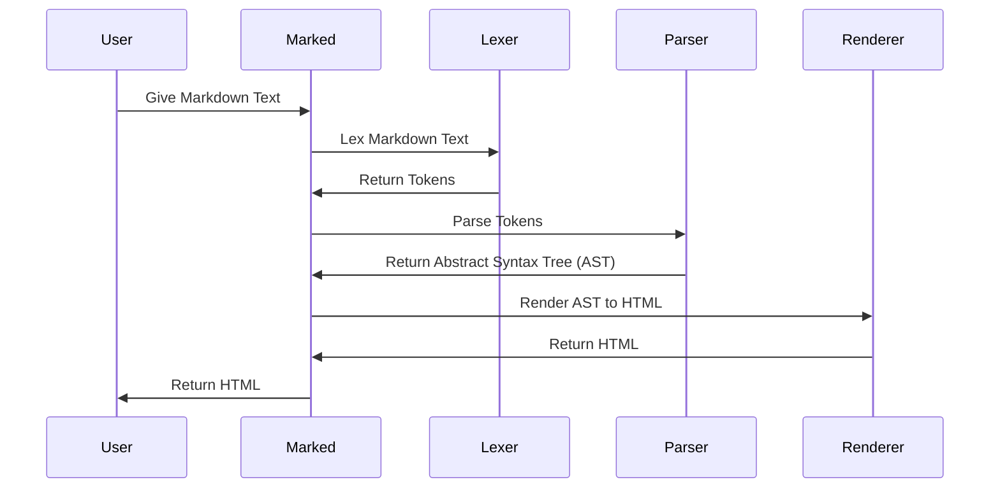

# Chapter 1: Marked (Instance)

Welcome to the world of `marked`! This tutorial will guide you through the core concepts of this powerful Markdown parser.

Imagine you have a plain text document written in Markdown, and you want to display it beautifully on a webpage. You need to convert that Markdown into HTML, which browsers understand. That's where `marked` comes in. Specifically, the `Marked` class handles this conversion.

Think of the `Marked` class as a special chef. You give it raw Markdown text (the ingredients), and it uses various tools and techniques (lexer, parser, renderer) to transform it into a delicious HTML dish. You can also configure the chef with specific instructions (options) and even add extra tools (extensions) to customize the final result.

Let's start with a basic example:

```javascript
import { Marked } from 'marked';

const marked = new Marked(); // Create a new chef!
const markdownText = '# Hello, world!';
const html = marked.parse(markdownText); // Cook the markdown!

console.log(html);
```

This code snippet creates a new `Marked` instance and then uses its `parse` method to convert the Markdown text "# Hello, world!" into HTML.  The `console.log(html)` will print out: `<h1>Hello, world!</h1>\n`. We've successfully turned Markdown into HTML!

## Key Concepts

The `Marked` class orchestrates the entire Markdown to HTML conversion process. Here's a breakdown of the key concepts involved:

1.  **Instance Creation:**  The `new Marked()` line creates an instance of the `Marked` class. This is like hiring a new chef. You can have multiple chefs, each with potentially different configurations.  The `markedInstance` in `src/marked.ts` is a default chef, used by the `marked()` function.

2.  **`parse` Method:** This method is the workhorse. It takes Markdown text as input and returns the corresponding HTML.  It's the chef taking your ingredients and giving you a cooked meal.

3.  **Options:** These are the chef's instructions.  They tell `marked` how to handle different Markdown features, such as how to render links, images, or code blocks. We'll delve deeper into [Marked Options](02_marked_options_.md) in the next chapter.

4.  **Extensions:** These are like giving the chef extra tools and skills.  Extensions allow you to customize `marked`'s behavior, adding support for new Markdown features or modifying existing ones.

## Using `Marked` to Convert Markdown

Let's expand on our initial example to make it more interesting:

```javascript
import { Marked } from 'marked';

const marked = new Marked();
const markdownText = `
# My Awesome Post

This is a paragraph of text with a [link](https://example.com).

*   An item in a list
*   Another item
`;

const html = marked.parse(markdownText);
console.log(html);
```

This example uses a more complex Markdown string, including a heading, paragraph, link, and list.  When you run this code, `marked.parse` will process the Markdown and generate the corresponding HTML.  The `console.log(html)` would then print the HTML that renders these elements correctly in a browser.

## Under the Hood: How it Works

Let's take a peek behind the scenes to understand how `marked` converts Markdown to HTML. Here's a simplified view of the process:



1.  **Lexing:** The `Lexer` ([Lexer](03_lexer_.md)) breaks down the Markdown text into a stream of tokens. Each token represents a distinct element, such as a heading, paragraph, or link. Think of this as the chef chopping the vegetables and preparing the ingredients.

2.  **Parsing:** The `Parser` ([Parser](06_parser_.md)) takes the tokens and builds an abstract syntax tree (AST). The AST represents the structure of the Markdown document. This is like the chef organizing the ingredients and planning the cooking process.

3.  **Rendering:** The `Renderer` ([Renderer](07_renderer_.md)) traverses the AST and generates the corresponding HTML. This is like the chef actually cooking the meal and plating it beautifully.

Let's look at some code snippets from `src/Instance.ts` to see how this is orchestrated:

```typescript
// src/Instance.ts

import { _Lexer } from './Lexer.ts';
import { _Parser } from './Parser.ts';

export class Marked {
  parse = this.parseMarkdown(true);

  lexer(src: string, options?: MarkedOptions) {
    return _Lexer.lex(src, options ?? this.defaults);
  }

  parser(tokens: Token[], options?: MarkedOptions) {
    return _Parser.parse(tokens, options ?? this.defaults);
  }
}
```

This code shows that the `Marked` class imports the `Lexer` and `Parser` classes. The `lexer` method uses `_Lexer.lex` to perform the lexing, and the `parser` method uses `_Parser.parse` to perform the parsing.  These are the key steps in the conversion process.

## Conclusion

In this chapter, you've learned about the `Marked` class, the core component of `marked` responsible for converting Markdown to HTML. You've seen how to create an instance of `Marked`, use its `parse` method to convert Markdown text, and gained a high-level understanding of the lexing, parsing, and rendering process that happens under the hood.

In the next chapter, we'll dive deeper into [Marked Options](02_marked_options_.md) and explore how to configure `marked` to customize its behavior.


---

Generated by [AI Codebase Knowledge Builder](https://github.com/The-Pocket/Tutorial-Codebase-Knowledge)