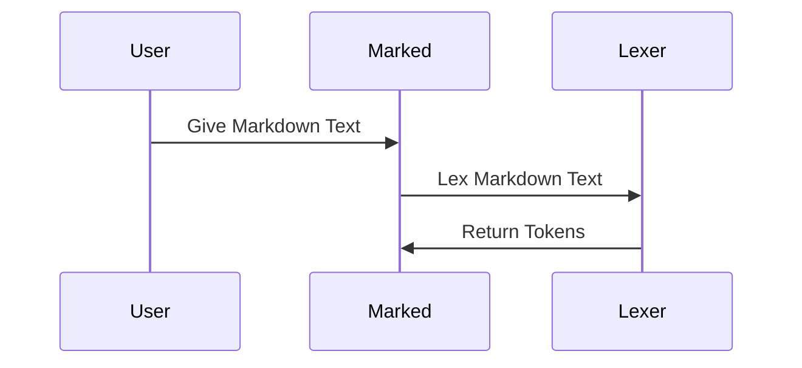

# Chapter 3: Lexer

In the previous chapter, [Marked Options](02_marked_options_.md), you learned how to customize the Markdown to HTML conversion process using options. Now, let's dive into one of the core components that makes this conversion possible: the `Lexer`.

Imagine you have a long recipe written in plain English. Before you can start cooking, you need to understand the instructions. You might first break down the recipe into individual steps: "Mix the flour," "Add the eggs," "Bake at 350 degrees." The `Lexer` does something similar for Markdown. It's like the first step in understanding the structure of your Markdown document.

The `Lexer` takes your raw Markdown text and breaks it down into smaller pieces called "tokens." These tokens represent the different elements of your Markdown, such as headings, paragraphs, lists, and links. These tokens provide structure to the raw text. It helps with separating plain text from markups to define what each word/block means.

## What is the `Lexer`?

The `Lexer` (primarily in `src/Lexer.ts`) is like a word counter at the beginning of a book writing. It breaks down the input Markdown text into a stream of tokens. These tokens represent distinct elements like headings, paragraphs, lists, etc. It's a preliminary step that identifies the *type* and content of each piece of Markdown, preparing it for more structured parsing. It is the first step for `Marked` to understand what the provided text is.

Think of it like this: you give the `Lexer` a sentence, and it tells you which words are nouns, verbs, adjectives, etc. In Markdown terms, you give the `Lexer` a Markdown document, and it tells you which parts are headings, paragraphs, links, etc.

## Key Concepts

*   **Tokens:** These are the individual pieces that the `Lexer` breaks the Markdown into. Each token has a `type` (e.g., `heading`, `paragraph`, `list_item`) and `content` (the actual text of the element).
*   **Tokenization:** The process of breaking down the Markdown text into tokens.

## Using the `Lexer`

While you typically don't interact with the `Lexer` directly, understanding how it works helps you understand the overall Markdown parsing process. The [Marked (Instance)](01_marked__instance__.md) chapter already shows how `Lexer` is used under the hood. Let's solidify this.

Here's a simplified example of what the `Lexer` does:

**Input (Markdown):**

```markdown
# My Heading

This is a paragraph.
```

**Output (Tokens - Simplified):**

```javascript
[
  { type: 'heading', depth: 1, text: 'My Heading' },
  { type: 'paragraph', text: 'This is a paragraph.' }
]
```

The `Lexer` has identified a heading and a paragraph in the input Markdown. It's labeled each with a `type` and extracted the relevant `text`.

Let's see how to use `Lexer` directly:

```javascript
import { Lexer } from 'marked';

const markdownText = '# Hello, world!';
const tokens = Lexer.lex(markdownText);

console.log(tokens);
```

This code snippet imports the `Lexer` from `marked`.  It then uses the `Lexer.lex` method to tokenize the Markdown text "# Hello, world!". The `console.log(tokens)` will print an array of tokens, representing the different elements in the Markdown text. The token array includes the heading token.

The output looks like this:
```json
[
  {
    "type": "heading",
    "raw": "# Hello, world!\n",
    "depth": 1,
    "text": "Hello, world!",
    "tokens": [
      {
        "type": "text",
        "raw": "Hello, world!",
        "text": "Hello, world!"
      }
    ]
  },
  {
    "type": "space",
    "raw": "\n"
  }
]
```

## Under the Hood: How the `Lexer` Works

The `Lexer` works by scanning the Markdown text and applying a series of rules to identify different elements.

Here's a simplified view of the process:



1.  **Input:** The `Lexer` receives the raw Markdown text as input.
2.  **Rule Application:** The `Lexer` iterates through the text, trying to match each line against a set of predefined rules. These rules are defined using regular expressions in `src/rules.ts` and used by the `Tokenizer`.
3.  **Token Creation:** When a rule matches a portion of the text, the `Lexer` creates a corresponding token with the appropriate `type` and `content`.
4.  **Output:** The `Lexer` returns an array of tokens, representing the entire Markdown document.

Let's look at a code snippet from `src/Lexer.ts` to see how the lexing process is initiated:

```typescript
// src/Lexer.ts
import { _Tokenizer } from './Tokenizer.ts';

export class _Lexer {
  constructor(options?: MarkedOptions) {
    this.tokenizer = new _Tokenizer();
  }

  static lex(src: string, options?: MarkedOptions) {
    const lexer = new _Lexer(options);
    return lexer.lex(src);
  }

  lex(src: string) {
    this.blockTokens(src, this.tokens);
    return this.tokens;
  }

  blockTokens(src: string, tokens: Token[] = [], lastParagraphClipped = false) {
    // ... logic to identify and create block-level tokens ...
  }
}
```

This code shows that the `Lexer` class has a `lex` method that takes the Markdown source as input. This method calls the `blockTokens` method to perform the actual lexing. The `blockTokens` method iterates through the source text and applies rules to identify block-level elements like headings, paragraphs, and lists. The class `_Tokenizer` is responsible to match specific rules for each type of token.

## Influence of Options

The [Marked Options](02_marked_options_.md) also impact the lexing process. For example, the `gfm` option enables or disables GitHub Flavored Markdown (GFM), which adds extra features like autolinking URLs and task lists.

The `Lexer` checks the `gfm` option and adjusts its rules accordingly. If `gfm` is enabled, the `Lexer` will recognize and tokenize GFM-specific elements. If it's disabled, those elements will be treated as plain text.

```typescript
// src/Lexer.ts

constructor(options?: MarkedOptions) {
  this.options = options || _defaults;
  // ...
  const rules = {
    other,
    block: block.normal,
    inline: inline.normal,
  };

  if (this.options.pedantic) {
    rules.block = block.pedantic;
    rules.inline = inline.pedantic;
  } else if (this.options.gfm) {
    rules.block = block.gfm;
    if (this.options.breaks) {
      rules.inline = inline.breaks;
    } else {
      rules.inline = inline.gfm;
    }
  }
  this.tokenizer.rules = rules;
}
```

This snippet shows how the `Lexer` selects different sets of rules based on the `gfm`, `pedantic` and `breaks` options. This allows `marked` to support different flavors of Markdown.

## Conclusion

In this chapter, you've learned about the `Lexer`, the component of `marked` responsible for breaking down Markdown text into tokens. You've seen how the `Lexer` identifies different elements of the Markdown and creates corresponding tokens. You've also gained a basic understanding of how the lexing process works and how options can influence it.

In the next chapter, we'll explore the [Tokenizer](04_tokenizer_.md), the component responsible for defining the rules and patterns used by the Lexer to identify different Markdown elements.


---

Generated by [AI Codebase Knowledge Builder](https://github.com/The-Pocket/Tutorial-Codebase-Knowledge)