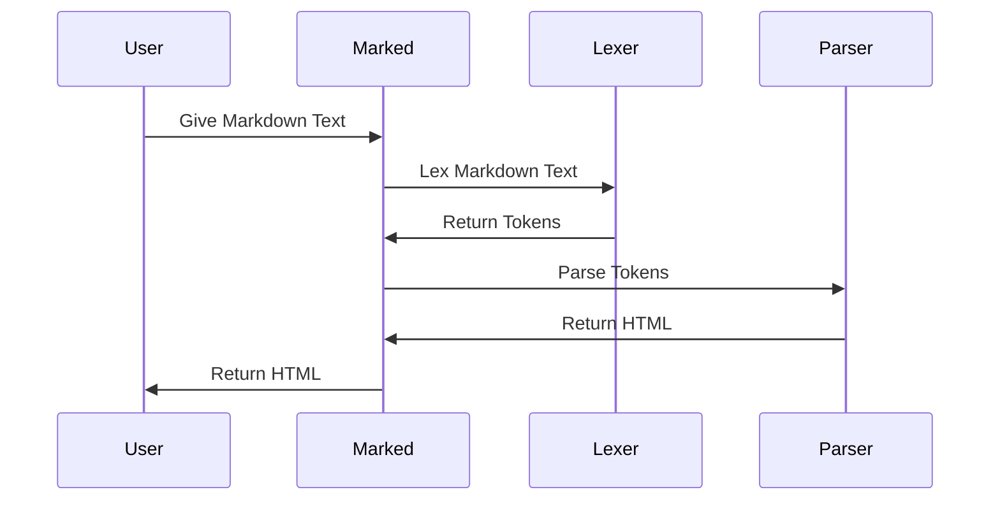

# Chapter 5: Tokens

In the previous chapter, [Tokenizer](04_tokenizer_.md), you learned how the `Tokenizer` uses regular expressions to define the rules for identifying different Markdown elements. Now, let's explore the data structures that *represent* those elements: `Tokens`.

Imagine you're building a house with LEGO bricks. The `Lexer` is like someone sorting the LEGOs into different categories (bricks, plates, slopes, etc.). `Tokens` are those individual LEGO bricks themselves, each labeled with its type and any relevant properties (color, size, etc.). They are how `marked` represents Markdown after breaking it down.

## The Need for Tokens: A Concrete Example

Let's say you want to convert the following Markdown into HTML:

```markdown
# My Awesome Title
```

To do this, `marked` needs to understand that "# My Awesome Title" is a heading.  The `Lexer` and `Tokenizer` work together to identify this and create a `Token` that represents this heading. This token will contain information like the heading level (1) and the heading text ("My Awesome Title").  Later, the [Parser](06_parser_.md) uses these tokens to generate the appropriate HTML: `<h1>My Awesome Title</h1>`.

## What are `Tokens`?

`Tokens` (defined in `src/Tokens.ts`) are the data structures that represent the different elements found in Markdown text after lexing. Think of them like building blocks (LEGOs). Each token represents a specific element like a heading, paragraph, link, or image, containing the text and any relevant attributes. The [Lexer](03_lexer_.md) produces a stream of tokens, which the [Parser](06_parser_.md) then uses to construct the final HTML output.

In short, a `Token` is a JavaScript object with properties that describe a Markdown element.

## Key Concepts

*   **`type`:**  A string that specifies the type of Markdown element the token represents (e.g., `'heading'`, `'paragraph'`, `'link'`). This is the most important property.
*   **`raw`:** The original Markdown text that the token represents.
*   **`text`:** The processed text content of the token.  For example, for a heading token, this would be the heading text without the '#' characters.
*   **Other Properties:** Tokens can have other properties specific to their type. For example, a `heading` token has a `depth` property (the heading level), and a `link` token has `href` (the URL) and `title` properties.

## Common Token Types

Here are a few common token types you'll encounter:

*   **`heading`:** Represents a heading (e.g., `# My Heading`).
    *   Properties: `depth` (heading level), `text` (heading text).
*   **`paragraph`:** Represents a paragraph of text.
    *   Properties: `text` (paragraph text).
*   **`list`:** Represents a list (ordered or unordered).
    *   Properties: `ordered` (boolean), `items` (array of list item tokens).
*   **`list_item`:** Represents a single item in a list.
    *   Properties: `text` (list item text).
*   **`link`:** Represents a hyperlink.
    *   Properties: `href` (URL), `text` (link text).
*   **`code`:** Represents a code block.
    *   Properties: `text` (code).

## How to Use Tokens (Indirectly)

You don't usually create or manipulate tokens directly. The [Lexer](03_lexer_.md) creates the tokens, and the [Parser](06_parser_.md) consumes them. However, understanding the structure of tokens is helpful for debugging and for customizing `marked` with extensions (which we'll cover later).

Let's revisit the example from the [Lexer](03_lexer_.md) chapter:

**Input (Markdown):**

```markdown
# My Heading

This is a paragraph.
```

**Tokens (Simplified):**

```javascript
[
  { type: 'heading', depth: 1, text: 'My Heading' },
  { type: 'paragraph', text: 'This is a paragraph.' }
]
```

These tokens are the *output* of the [Lexer](03_lexer_.md). The [Parser](06_parser_.md) then takes these tokens as *input* to generate HTML.

## Examining Tokens

If you want to see the tokens generated by `marked`, you can use the `Lexer.lex` method and log the result:

```javascript
import { Lexer } from 'marked';

const markdownText = '# Hello, world!\n\nThis is a paragraph.';
const tokens = Lexer.lex(markdownText);

console.log(JSON.stringify(tokens, null, 2)); // Pretty print the tokens
```

This will print a JSON representation of the tokens array to the console, allowing you to inspect their `type` and properties. The `JSON.stringify(tokens, null, 2)` part is just for making the output easier to read.

## Under the Hood: How Tokens are Created and Used

Let's visualize how `Tokens` are created and passed between different components of `marked`:



1.  **Lexing:** The [Lexer](03_lexer_.md) breaks down the Markdown text into a stream of `Tokens`.
2.  **Parsing:** The [Parser](06_parser_.md) takes the `Tokens` and constructs an abstract syntax tree (AST).
3.  **Rendering:** (covered in a later chapter) The [Renderer](07_renderer_.md) traverses the AST and generates the corresponding HTML.

Let's look at some code from `src/Lexer.ts` to see how the tokens are created and the file `src/Tokens.ts` to see their type definitions:

```typescript
// src/Lexer.ts
import { _Tokenizer } from './Tokenizer.ts';
import type { Tokens } from './Tokens.ts';

export class _Lexer {
  // ...
  heading(src: string): Tokens.Heading | undefined { // heading function returns a heading Token
    const cap = this.rules.block.heading.exec(src);
    if (cap) {
      return {
        type: 'heading',
        raw: cap[0],
        depth: cap[1].length,
        text: cap[2].trim(),
        tokens: this.lexer.inline(cap[2].trim()),
      };
    }
  }
  // ...
}
```

This snippet shows how a `heading` token is created by the `heading` method in `Lexer`. The `type` is set to `'heading'`, the `depth` is determined by the number of `#` characters, and the `text` is extracted. The `Tokens.Heading` type ensures that the token has the correct properties.

```typescript
// src/Tokens.ts

export namespace Tokens {
  export interface Heading {
    type: 'heading';
    raw: string;
    depth: number;
    text: string;
    tokens: Token[];
  }
  // ...
}
```

This code defines the `Heading` interface, specifying the properties that a `heading` token must have.

## Conclusion

In this chapter, you've learned about `Tokens`, the data structures that represent the different elements of a Markdown document after the lexing process. You've seen how the [Lexer](03_lexer_.md) creates these tokens and how they are used as input to the [Parser](06_parser_.md).

In the next chapter, we'll dive deeper into the [Parser](06_parser_.md), which takes the tokens and builds an abstract syntax tree (AST) representing the structure of the Markdown document.


---

Generated by [AI Codebase Knowledge Builder](https://github.com/The-Pocket/Tutorial-Codebase-Knowledge)