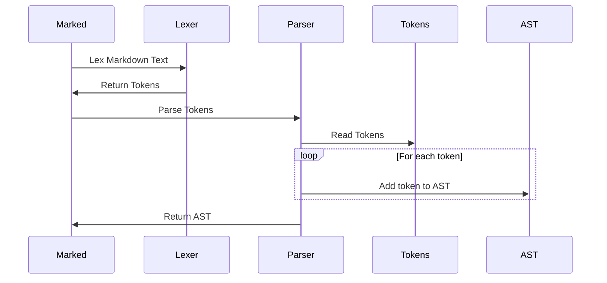

# Chapter 6: Parser

In the previous chapter, [Tokens](05_tokens_.md), you learned how the `Lexer` transforms Markdown text into a stream of `Tokens`, each representing a different element of the document. Now, let's explore how these individual `Tokens` are organized into a structured representation: the job of the `Parser`.

Imagine you have a pile of LEGO bricks ([Tokens](05_tokens_.md)), each representing a part of a house (wall, roof, window). The `Parser` is like the architect who takes those individual bricks and assembles them into a blueprint for the whole house, showing how all the pieces fit together. It helps organize the tokens and establish their relationship with each other so that `marked` can understand the structure of the markdown text.

## The Need for a Parser: A Concrete Example

Let's say you have this Markdown:

```markdown
# My Blog Post

This is the first paragraph.

## Section 1

This is a section in the blog post.
```

The `Lexer` will give you a list of `Tokens`, saying there's a heading, a paragraph, another heading, and another paragraph. But it doesn't tell you that "Section 1" is a *subsection* of "My Blog Post," or that the paragraphs belong under their respective headings.

The `Parser` takes those tokens and builds a *structure* that represents that relationship. It knows that the second heading is nested inside the first one, creating a hierarchical representation.

## What is the `Parser`?

The `Parser` (primarily in `src/Parser.ts`) takes the tokens generated by the [Lexer](03_lexer_.md) and structures them into a hierarchical representation of the document. It's akin to building a house frame: it organizes the pieces (tokens) in their correct relationships to each other (headings inside sections, list items within lists). This structure makes it easier to convert the Markdown into HTML.

Think of it like organizing your files into folders on your computer. You don't just dump everything into one giant folder; you create subfolders to keep things organized. The `Parser` does the same thing for Markdown `Tokens`.

## Key Concepts

*   **Abstract Syntax Tree (AST):** The hierarchical structure that the `Parser` creates. It represents the relationships between the different elements in the Markdown document.
*   **Hierarchical Structure:** A tree-like organization where elements are nested within each other (like folders within folders).

## Using the `Parser` (Indirectly)

You don't typically interact with the `Parser` directly. The [Marked (Instance)](01_marked__instance__.md) handles calling the `Parser` for you. However, knowing what the `Parser` does helps you understand how `marked` works overall.

Let's revisit our Markdown example:

```markdown
# My Blog Post

This is the first paragraph.

## Section 1

This is a section in the blog post.
```

The `Parser` would take the `Tokens` from the [Lexer](03_lexer_.md) and create a structure that looks *conceptually* like this (it's not actual code, just to illustrate):

```javascript
{
  type: 'root',
  children: [
    {
      type: 'heading',
      depth: 1,
      text: 'My Blog Post',
      children: [
        {
          type: 'paragraph',
          text: 'This is the first paragraph.'
        },
        {
          type: 'heading',
          depth: 2,
          text: 'Section 1',
          children: [
            {
              type: 'paragraph',
              text: 'This is a section in the blog post.'
            }
          ]
        }
      ]
    }
  ]
}
```

This shows how the `Parser` understands that "Section 1" is a sub-heading within "My Blog Post," and the paragraphs belong under the appropriate headings.  This isn't the exact output, but it shows how the `Parser` organizes things.

## Under the Hood: How the `Parser` Works

The `Parser` works by iterating through the `Tokens` generated by the [Lexer](03_lexer_.md) and building the Abstract Syntax Tree (AST) based on the token types and their properties.

Here's a simplified view of the process:



1.  **Input:** The `Parser` receives an array of `Tokens` from the [Lexer](03_lexer_.md).
2.  **Iteration:** The `Parser` iterates through the `Tokens` one by one.
3.  **AST Construction:** Based on the `type` of each `Token`, the `Parser` adds it to the AST in the correct location, maintaining the hierarchical structure. For example, when it encounters a `heading` token, it creates a new heading node in the AST. When it encounters a `paragraph` token, it adds it as a child of the current heading node (or the root node if there's no heading).
4.  **Output:** The `Parser` returns the completed AST, representing the structure of the Markdown document.

Let's look at a simplified code snippet from `src/Parser.ts` to see how the parsing process is implemented:

```typescript
// src/Parser.ts

export class _Parser {
  // ...

  parse(tokens: Token[], top = true): string {
    let out = '';

    for (let i = 0; i < tokens.length; i++) {
      const token = tokens[i];

      switch (token.type) {
        case 'heading': {
          // Render the heading token
          // ...
          break;
        }
        case 'paragraph': {
          // Render the paragraph token
          // ...
          break;
        }
        // ... other token types
      }
    }

    return out;
  }
}
```

This snippet shows the `parse` method iterating through the `Tokens`. Inside the `switch` statement, it handles different `Token` types. The logic for building the actual AST isn't shown here (it is more complex), but the code demonstrates how the `Parser` examines each `Token` and takes action based on its `type`. The current implementation of `parse` already renders the tokens to HTML, but you can imagine it building a structure for each token type to represent the AST before rendering to HTML.

## How Options Influence the Parser

The [Marked Options](02_marked_options_.md) also impact the `Parser`. Options like `gfm` (GitHub Flavored Markdown) affect how the `Parser` handles specific Markdown features, such as task lists or strikethrough text.

## Conclusion

In this chapter, you've learned about the `Parser`, the component of `marked` responsible for taking the `Tokens` generated by the [Lexer](03_lexer_.md) and building a hierarchical representation of the Markdown document (the AST). While you may not directly interact with the `Parser`, understanding its role is crucial to understanding the overall Markdown to HTML conversion process.

In the next chapter, we'll explore the [Renderer](07_renderer_.md), the component that takes the Abstract Syntax Tree (AST) and generates the final HTML output.


---

Generated by [AI Codebase Knowledge Builder](https://github.com/The-Pocket/Tutorial-Codebase-Knowledge)