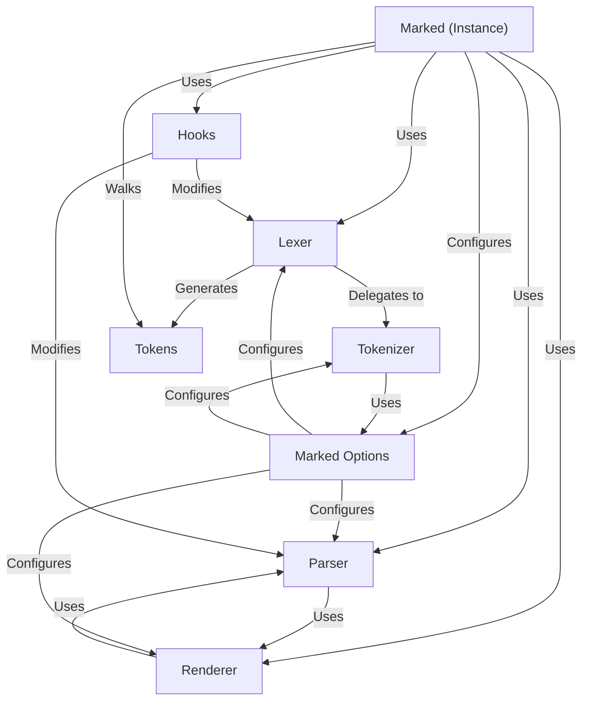

# Tutorial: marked

The `marked` project is a **Markdown** *compiler*. It takes Markdown-formatted text as input and transforms it into **HTML**, which can be displayed in a web browser.  It provides options and extensions to customize the conversion process.

**Source Repository:** [https://github.com/markedjs/marked.git](https://github.com/markedjs/marked.git)

## Chapters

1. [Marked (Instance)
](01_marked__instance__.md)
2. [Marked Options
](02_marked_options_.md)
3. [Lexer
](03_lexer_.md)
4. [Tokenizer
](04_tokenizer_.md)
5. [Tokens
](05_tokens_.md)
6. [Parser
](06_parser_.md)
7. [Renderer
](07_renderer_.md)
8. [Hooks
](08_hooks_.md)

---

Generated by [AI Codebase Knowledge Builder](https://github.com/The-Pocket/Tutorial-Codebase-Knowledge)